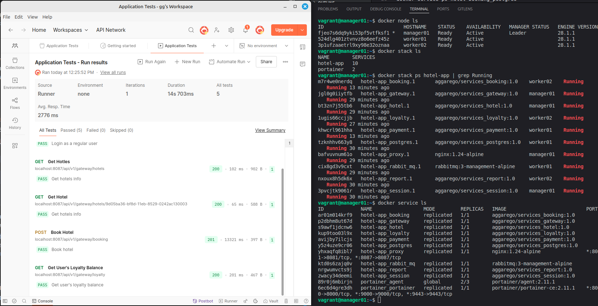

# Container orchestration on Docker Swarm

В папке ./src/ можно найти пример мультисервисного приложения. Ниже представлена его концептуальная схема.


Проект написан на языке java (jdk8). Cамо приложение представляет из себя сервис по бронированию номеров. Вернее его backend. Состоит этот backend из девяти сервисов:

1. База данных postgres.
2. Очередь сообщений rabbitmq.
3. Session service - сервис управляющий сессиями пользователей.
4. Hotel service - сервис управляющий сущностью отелей.
5. Payment service - сервис управляющий оплатой.
6. Loyalty service - сервис управляющий программой лояльности.
7. Report service - сервис осуществляющий сбор статистики.
8. Booking service - сервис управляющий резервированием.
9. Gateway service - фасад для взаимодействия с остальными микросервисами

## Part 1. Запуск сервисов через docker compose

1. Написал Dockerfile для каждого микросервиса.

```Dockerfile
# build
FROM openjdk:8-jdk-alpine AS build

WORKDIR /app

COPY .mvn ./.mvn
COPY mvnw .
COPY pom.xml .
RUN ./mvnw dependency:go-offline

COPY src ./src
RUN ./mvnw package -DskipTests

#run
FROM openjdk:8-jdk-alpine

WORKDIR /app

COPY --from=build /app/target/*.jar app.jar
COPY wait-for-it.sh .
RUN apk add --no-cache bash && \
    chmod +x wait-for-it.sh
EXPOSE 8085

ENTRYPOINT ["./wait-for-it.sh", "postgres:5432", "-t", "60", "--", "java", "-jar", "app.jar"]
```
Dockerfile выполнил по multistage building для уменьшения размера образа. В начале происходит сборка jar файлов: перенос враппера maven и pom.xml, установка зависимостей `./mvnw dependency:go-offline` и сборка путем выполнения `./mvnw package -DskipTests`. Далее копируются собранные jar файлы, ставятся зависимости. В entrypoint указываю исполнение скрипта wait-for-it.sh который проверяет, что необходимые сервисы для запуска развернуты, а далее запускает собранное приложение: `java -jar app.jar`.

Сравнение образов, собранных по multistage и single сборке. Первый занимает меньше места, так как не содержит зависимостей для сборки, а только необходимые файлы.


2. Написал docker-compose.yml (./src/docker-compose.yml) для запуска сервисов. Пробросил порты к gateway и session сервисам.

3. Командой `docker-compose up -d` запустил стек сервисов на локальной машине


4. С помощью postman протестил, что сервисы корректно отрабатывают. Импортировал коллекцию `application_tests.postman_collection.json` и запустил тестирование.


## Part 2. Создание вирутальный машин с помощью vagrant

1. Установил и инициализировал vagrant: `vagrant init`. написал vagrantfile для ВМ: взял версию ubuntu 20.04, выделил 1 ГБ памяти, 1 ядро процессора, сеть и адрес по dhcp, общую папку ./services c исходным кодом сервисов и обновление доступных пакетов.


2. С помощью `vagrant up` поднял виртуальную машину.


3. Командой `vagrant ssh` подключился по ssh к ВМ и проверил, что исходный код корректно перенесся. 


4. Остановил и уничтожил машину командой `vagrant destroy -f`.


## Part 3. Docker Swarm

1. Переписал vagrantfile для создания 3-х нод: manager и 2 worker'а. 
В inline shell написал скрипт проверки наличия папки services с исходным кодом и запуск скрипта инициализации менеджера docker swarm, а также подключения воркеров к менеджеру. Так же docker-compose.yml копируется на менеджера, и на всех нодах устанавливается docker. Cкрипты находятся в директории `./src/services/scripts`.

```Ruby
#Vagrantfile
Vagrant.configure("2") do |config|
  config.vm.box = "ubuntu/focal64"
  config.vm.box_check_update = false
  config.vm.synced_folder "./services", "/home/vagrant/services"
  config.vm.provision "shell", path: "services/scripts/install-docker.sh"
  config.vm.provider "virtualbox" do |vb|
    vb.gui = false
    vb.memory = "2048"
    vb.cpus = 2
  end

  config.vm.define "manager01" do |manager|
    manager.vm.hostname = "manager01"
    manager.vm.network "private_network", ip: "192.168.56.2"
    manager.vm.network "forwarded_port", guest: 8081, host: 8081
    manager.vm.network "forwarded_port", guest: 8087, host: 8087
    manager.vm.network "forwarded_port", guest: 9000, host: 9000
    manager.vm.provision "file",
      source: "./docker-compose.yml",
      destination: "/home/vagrant/docker-compose.yml"
    manager.vm.provision "shell", inline: <<-SHELL
      if [ -d "/home/vagrant/services" ]; then
        echo "services are exists"
      else
        echo "error: services are not found"
      fi
      bash /home/vagrant/services/scripts/swarm-init.sh
    SHELL
  end

  config.vm.define "worker01" do |worker|
    worker.vm.hostname = "worker01"
    worker.vm.network "private_network", ip: "192.168.56.3"
    worker.vm.provision "shell", inline: <<-SHELL
      if [ -d "/home/vagrant/services" ]; then
        echo "services are exists"
      else
        echo "error: services are not found"
      fi
      bash /home/vagrant/services/scripts/swarm-join.sh
    SHELL
  end


  config.vm.define "worker02" do |worker|
    worker.vm.hostname = "worker02"
    worker.vm.network "private_network", ip: "192.168.56.4"
    worker.vm.provision "shell", inline: <<-SHELL
      if [ -d "/home/vagrant/services" ]; then
        echo "services are exists"
      else
        echo "error: services are not found"
      fi
      bash /home/vagrant/services/scripts/swarm-join.sh
    SHELL
  end
end
```
2. На Docker hub загрузил собранные образы и переписал docker-compose.yml добавив инструкции `image: ...` вместо `build: ...` для загрузки образов с docker hub. Поменял драйвер сети на `overlay`. Убрал прямой проброс портов с сервисов gateway и session, настроил reverse-proxy на базе nginx. Установил правила запуска proxy, session и gateway только на менеджере.

```yml
#docker-compose.yml
version: '3.8'
services:
    proxy:
        image: nginx:1.24-alpine
        ports:
            - 8081:8081
            - 8087:8087
        volumes:
            - ./services/nginx-proxy/nginx.conf:/etc/nginx/nginx.conf
        deploy:
            replicas: 1
            placement:
                constraints: [node.role == manager]
        networks:
            - app-network
    postgres:
        image: aggarego/services_postgres:1.0
        environment:
            POSTGRES_USER: postgres
            POSTGRES_PASSWORD: "postgres"
        volumes:
            - postgres_data:/var/lib/postgresql/data
        networks:
            - app-network
    rabbit_mq:
        image: rabbitmq:3-management-alpine
        environment:
            RABBITMQ_DEFAULT_USER: guest
            RABBITMQ_DEFAULT_PASS: guest
        volumes:
            - rabbitmq_data:/var/lib/rabbitmq
        networks:
            - app-network
    session:
        image: aggarego/services_session:1.0
        environment:
            POSTGRES_HOST: postgres
            POSTGRES_PORT: 5432
            POSTGRES_USER : postgres
            POSTGRES_PASSWORD: "postgres"
            POSTGRES_DB: users_db
        depends_on:
            - postgres
            - proxy
        deploy:
            placement:
                constraints: [node.role == manager]
        networks:
            - app-network
    hotel:
        image: aggarego/services_hotel:1.0
        environment:
            POSTGRES_HOST: postgres
            POSTGRES_PORT: 5432
            POSTGRES_USER : postgres
            POSTGRES_PASSWORD: "postgres"
            POSTGRES_DB: hotels_db
        depends_on:
            - postgres
        networks:
            - app-network
    payment:
        image: aggarego/services_payment:1.0
        environment:
            POSTGRES_HOST: postgres
            POSTGRES_PORT: 5432
            POSTGRES_USER : postgres
            POSTGRES_PASSWORD: "postgres"
            POSTGRES_DB: payments_db
        depends_on:
            - postgres
        networks:
            - app-network
    loyalty:
        image: aggarego/services_loyalty:1.0
        environment:
            POSTGRES_HOST: postgres
            POSTGRES_PORT: 5432
            POSTGRES_USER : postgres
            POSTGRES_PASSWORD: "postgres"
            POSTGRES_DB: balances_db
        depends_on:
            - postgres
        networks:
            - app-network
    report:
        image: aggarego/services_report:2.0
        environment:
            POSTGRES_HOST: postgres 
            POSTGRES_PORT: 5432
            POSTGRES_USER : postgres
            POSTGRES_PASSWORD: "postgres"
            POSTGRES_DB: statistics_db
            RABBIT_MQ_HOST: rabbit_mq
            RABBIT_MQ_PORT: 5672
            RABBIT_MQ_USER: guest
            RABBIT_MQ_PASSWORD: guest
            RABBIT_MQ_QUEUE_NAME: messagequeue
            RABBIT_MQ_EXCHANGE: messagequeue-exchange
        depends_on:
            - postgres
            - rabbit_mq
        networks:
            - app-network
    booking:
        image: aggarego/services_booking:2.0
        environment:
            POSTGRES_HOST: postgres
            POSTGRES_PORT: 5432
            POSTGRES_USER : postgres
            POSTGRES_PASSWORD: "postgres"
            POSTGRES_DB: reservations_db
            RABBIT_MQ_HOST: rabbit_mq
            RABBIT_MQ_PORT: 5672
            RABBIT_MQ_USER: guest
            RABBIT_MQ_PASSWORD: guest
            RABBIT_MQ_QUEUE_NAME: messagequeue
            RABBIT_MQ_EXCHANGE: messagequeue-exchange
            HOTEL_SERVICE_HOST: hotel
            HOTEL_SERVICE_PORT: 8082
            PAYMENT_SERVICE_HOST: payment
            PAYMENT_SERVICE_PORT: 8084
            LOYALTY_SERVICE_HOST: loyalty
            LOYALTY_SERVICE_PORT: 8085
        depends_on:
            - postgres
            - rabbit_mq
            - hotel
            - payment
            - loyalty
        networks:
            - app-network
    gateway:
        image: aggarego/services_gateway:2.0
        environment:
            SESSION_SERVICE_HOST: session
            SESSION_SERVICE_PORT: 8081
            HOTEL_SERVICE_HOST: hotel
            HOTEL_SERVICE_PORT: 8082
            BOOKING_SERVICE_HOST: booking
            BOOKING_SERVICE_PORT: 8083
            PAYMENT_SERVICE_HOST: payment
            PAYMENT_SERVICE_PORT: 8084
            LOYALTY_SERVICE_HOST: loyalty
            LOYALTY_SERVICE_PORT: 8085
            REPORT_SERVICE_HOST: report
            REPORT_SERVICE_PORT: 8086
        depends_on:
            - proxy
            - session
            - hotel
            - booking
            - payment
            - loyalty
            - report
        deploy:
            placement:
                constraints: [node.role == manager]
        networks:
            - app-network

volumes:
  postgres_data:
  rabbitmq_data:
networks:
  app-network:
    driver: overlay
```
3. Поднял виртуальные машины и запустил стек сервисов используя docker-compose.yml файл: `docker stack deploy -c docker-compose.yml hotel-app`. Через Postman прогнал тесты сервисов и удостоверился, что все корректно работает.



4. Написал скрипт для установки portainer отдельным стеком (./src/services/scripts/portainer.sh). По адресу `localhost:9000` перешел в веб интерфейс portainer.
Распределение сервисов по нодам:

